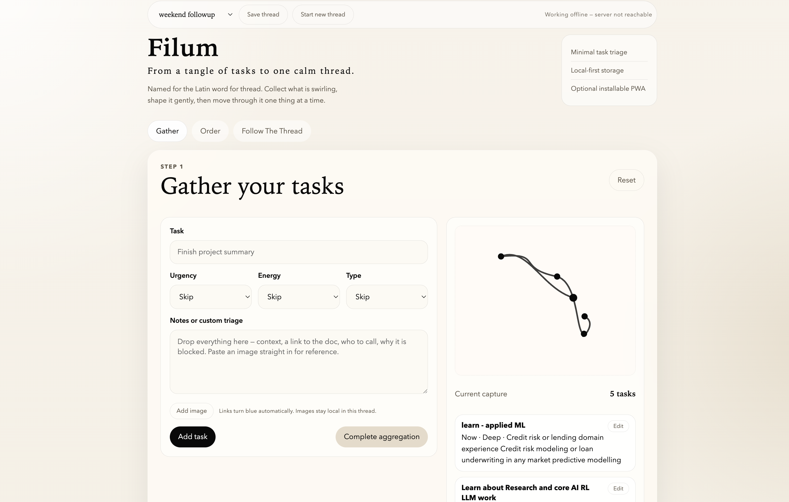

# Filum

Filum gives you a flow:

1. **Gather** — capture all the tasks currently occupying your mind.
2. **Choose the order** — move tasks into a usable sequence and optionally add rough durations.
3. **Follow the thread** — focus on one task at a time.

It is useful when you have too many competing tasks and need a calm, local, minimal way to convert them into a sequence.

## Circumspection

Circumspection is Filum's independent private writing space. Open it from the
compact book control in the top bar, or use the adjacent three strokes to open
the global Catalogue.

Writing is direct: text and the caret remain visible at input speed. A compact
rich-text bar stays above the diary, while task-note controls stay below the
input near the caret. Both provide bold, italic, underline, lists, and labelled
links without asking the writer to remember markup. Click any word to edit it
in place, including words on earlier leaves. Page breaks can be added at the
caret with **Turn the leaf** or `Cmd/Ctrl+Enter`. Entries have no titles and
remain independent from Filum threads.

The Catalogue is a wide typographic list: opening an entry reads and edits in
one place, while its bin control moves it to a recoverable local bin. Filum
keeps at most one blank entry and creates the next leaf only when writing
reaches it or the writer deliberately turns at the caret.

Basic defaults live in **Preferences**; **Personalise for me** opens the larger
customisation surface. The direct writing model uses `Ink effect: None`, with
no delayed reveal, blur, or post-text animation. Circumspection is
desktop/web-first; responsive mobile layouts remain available as a secondary
path.

## A quick look



## Requirements

You need:

- Windows, macOS, or a Unix/Linux based system
- Node.js `18` or newer


## setup

### 1. Install system dependencies

install Node.js 18+ using your preferred method.

```bash
sudo apt install -y nodejs
node --version
```
Make sure the version is `v18.x` or newer.


On macOS with Homebrew:

```bash
brew install git node
node --version
```

On Windows with PowerShell and WinGet:

```powershell
winget install OpenJS.NodeJS.LTS
node --version
```

### 2. Clone the repository

```bash
git clone https://github.com/ManikSinghSarmaal/filum.git
cd filum
```

### 3. Run the local server

```bash
node server.js
```

You should see something like:

```text
[filum] serving on http://localhost:4317
[filum] threads at /home/<user>/.filum/threads
```

Now open the app in your browser:

```text
http://localhost:4317
```

## Storage

By default, Filum stores your saved threads here:

```bash
~/.filum/threads
```

Each thread is stored as a separate `.json` file.

Circumspection uses one independent global file and an offline browser mirror:

```text
~/.filum/circumspection.json
localStorage: filum:circumspection:v1
```

Deleting or archiving a thread does not delete its independent Circumspection
entries. Global Personalisation settings are stored in
`~/.filum/settings.json`.

Filum can optionally initialise a Git repository inside `~/.filum` from
**Personalise for me**. Only thread JSON in `threads/`, `archive/`, and `bin/`
is tracked. Each edit retains the original text date as its Git author date
while recording the actual save time as the committer date. Git is optional:
ordinary JSON persistence remains the source of truth and continues if Git is
unavailable.

To use a custom storage directory:

```bash
FILUM_THREADS_DIR=/path/to/my/filum-threads node server.js
```

Example:

```bash
mkdir -p ~/Documents/filum-threads
FILUM_THREADS_DIR=~/Documents/filum-threads node server.js
```

## Custom port

The default port is `4317`.

To run Filum on another port:

```bash
FILUM_PORT=8080 node server.js
```

Then open:

```text
http://localhost:8080
```

You can combine custom port and custom storage:

```bash
FILUM_PORT=8080 FILUM_THREADS_DIR=~/Documents/filum-threads node server.js
```

## Optional: create a small launcher script

From inside the repo:

```bash
cat > run-filum.sh <<'SCRIPT'
#!/usr/bin/env bash
set -euo pipefail

cd "$(dirname "$0")"
node server.js
SCRIPT

chmod +x run-filum.sh
./run-filum.sh
```

Now you can start Filum with:

```bash
./run-filum.sh
```

## Optional: run Filum in the background

For a simple background run:

```bash
nohup node server.js > filum.log 2>&1 &
```

Check logs:

```bash
tail -f filum.log
```

Stop it:

```bash
pkill -f "node server.js"
```

## Optional: systemd service on Linux

If you want Filum to start automatically on boot, create a user-level systemd service.

First, get the absolute path of the repo:

```bash
pwd
```

Then create the service file:

```bash
mkdir -p ~/.config/systemd/user
nano ~/.config/systemd/user/filum.service
```

Paste this, replacing `/absolute/path/to/filum` with your actual repo path:

```ini
[Unit]
Description=Filum local thread server
After=network.target

[Service]
Type=simple
WorkingDirectory=/absolute/path/to/filum
ExecStart=/usr/bin/env node server.js
Restart=on-failure
Environment=FILUM_PORT=4317

[Install]
WantedBy=default.target
```

Enable and start it:

```bash
systemctl --user daemon-reload
systemctl --user enable --now filum.service
```

Check status:

```bash
systemctl --user status filum.service
```

View logs:

```bash
journalctl --user -u filum.service -f
```
